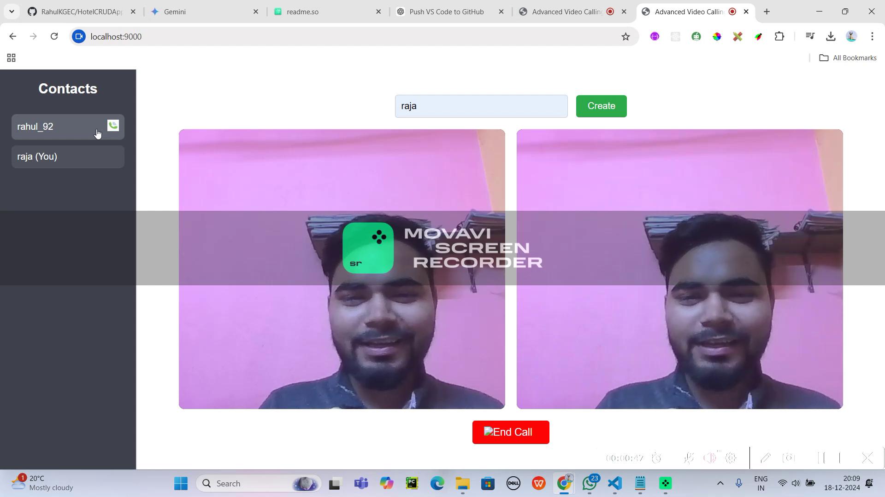
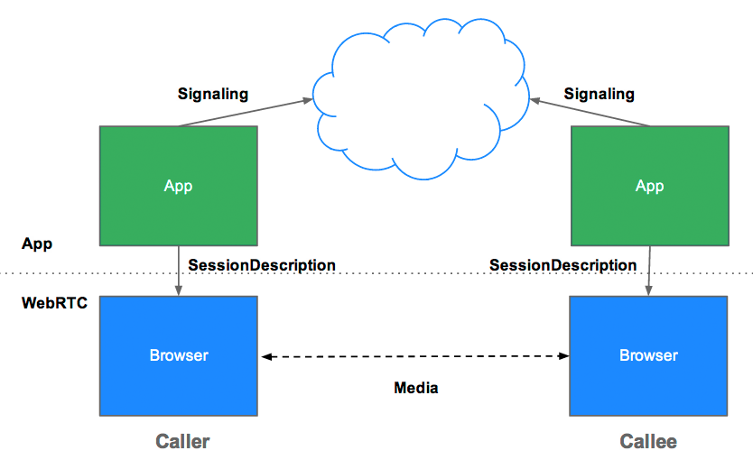

# Video Calling App

## Overview
The **Video Calling App** is a real-time peer-to-peer communication application that enables users to connect and communicate with each other through video calls. Built using **Socket.IO** for real-time communication and **WebRTC** for peer-to-peer video streaming, this application provides a seamless, interactive video calling experience. Users can join a session by entering their username, view all available users, and initiate video calls directly.
# Video Calling App

## Project Demo

You can watch a demo of the Video Calling App here:

[](https://www.youtube.com/watch?v=vM_AE8Jlu90)

Alternatively, you can [click here to watch the video](https://www.youtube.com/watch?v=vM_AE8Jlu90).

# Screen Shots
### Calling Page


### webRTC Peer to Peer connection Flow


## Features
- **User Authentication**: Users can join with a unique username.
- **Real-Time Communication**: Powered by **Socket.IO**, users can see when others join, leave, or make a call.
- **WebRTC Integration**: Enables real-time video and audio streaming between connected users.
- **Call Management**: Users can start and end video calls easily.
- **Responsive UI**: Simple, intuitive interface designed to work across multiple devices.

## Technologies Used
- **Backend**: 
  - **Node.js**: A JavaScript runtime environment for building the backend server.
  - **Express.js**: A minimal web framework for Node.js to handle routing and HTTP requests.
  - **Socket.IO**: A library that enables real-time, bidirectional communication between the server and client.
  
- **Frontend**: 
  - **WebRTC**: A technology that allows real-time communication in the browser, enabling video and audio calls without additional plugins.
  - **HTML5, CSS3, JavaScript**: Standard web technologies for building the user interface.

- **Other**: 
  - **STUN Servers**: Used for establishing peer-to-peer connections in WebRTC.
  - **Media Devices**: `getUserMedia` API is used for accessing users' cameras and microphones.

## Installation
### Prerequisites
Make sure you have **Node.js** and **npm** installed. You can download Node.js from [here](https://nodejs.org/).

### Steps
1. **Clone the Repository**
   ```bash
   git clone https://github.com/yourusername/video-calling-app.git
   cd video-calling-app
2. **Start the app**
   ```bash
     cd video-calling-app
     npm run start

## Authors

- [Rahul Shaw](https://github.com/RahulKGEC)
